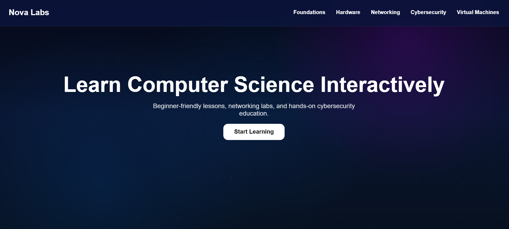
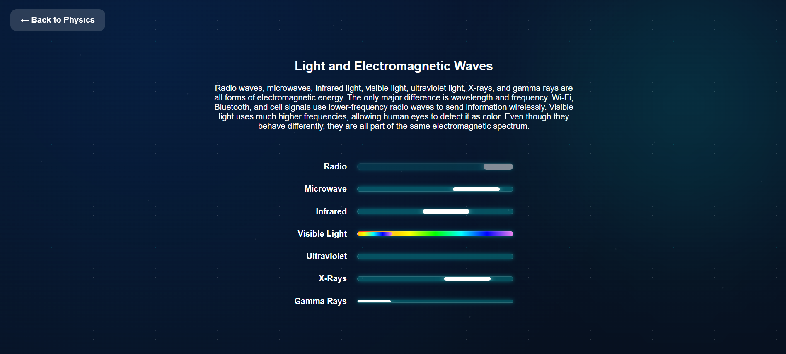

# Nova Labs
Live Site: https://www.nova-labs.sh/

An interactive computer science learning platform built with Flask. Being built by a self-taught developer who believes education should be accessible, visual, and free.

## Screenshots

### Home Page



## Goal

Nova Labs is designed to make technical concepts approachable for beginners through interactive lessons, visual explanations, and hands-on exploration.

Topics include:

- Physics Foundations
- Computer Basics
- Networking
- Python
- Cybersecurity
- Virtual Machines

## Features

- Interactive learning paths
- Beginner-friendly explanations
- Accessible design principles
- Responsive web interface
- Flask-powered backend

### Interactive Learning Lab



## Tech Stack

- Python
- Flask
- HTML
- CSS
- JavaScript

## Current Status

Active development.

Physics Foundations is currently the most complete learning section.

Computer Basics, Networking, and Python paths are under development.

## Local Setup

Clone the repository:

```bash
git clone https://github.com/ander-ctrl-dev/nova-labs.git
```

## Local Setup

Install Flask:
```bash
pip install Flask
```

Run the application:
```bash
python app.py
```
Visit:
``` text
http:127.0.0.1:5000
```


